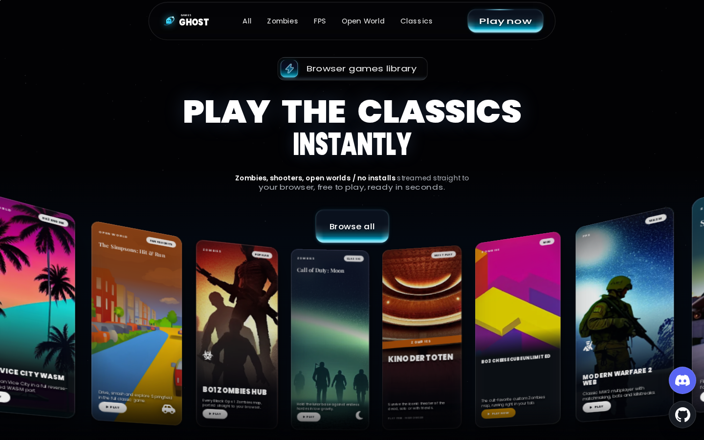
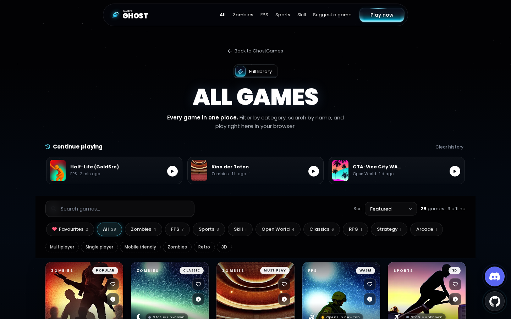
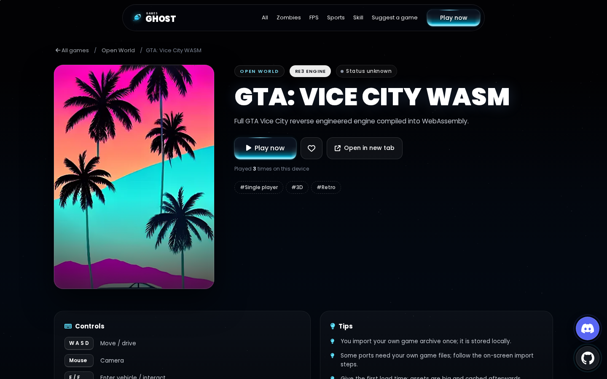
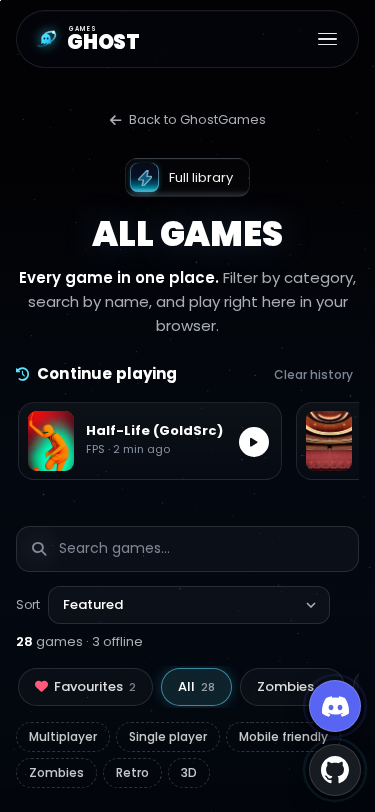

# 👻 GhostGames: Browser Games Library

Play classic and WebAssembly game ports right in your browser. There are no downloads, no installs and no account. Pick a game from the spinning 3D library, hit **Play**, and it opens in the built-in player.

## ▶️ [Play now: GhostGames Library](https://ghostfacezen-portfolio.onrender.com/ghostgames/)

Alternate (GitHub Pages): **[ghostfacemodz.github.io/GhostGames/new/](https://ghostfacemodz.github.io/GhostGames/new/)** · Classic version: [ghostfacemodz.github.io/GhostGames/](https://ghostfacemodz.github.io/GhostGames/)

## ✨ Features
- **3D spinning game library** with an original cover for every game
- **In-page player** with fullscreen, open in a new tab, and a fallback for games that block embedding
- **Browse all games** with category tabs, search, sorting (Featured, A–Z, Newest, Category) and tag filters (Multiplayer, Mobile friendly, Retro and more)
- **Continue playing and favourites**, saved on your device
- **A page for every game** with controls, tips, tags and similar games
- **Status dots**: 🟢 Online, 🟠 Issues (up but having problems), 🔴 Down
- **Hover previews** on desktop
- **Community**: a [Discord](https://discord.gg/zenclipsdaily-arc-raiders-store-bloodstrike-1408818003591827539) button and a Suggest-a-game form
- Works on desktop, tablet and phone

## 📸 Screenshots
| Library | Game page |
|---|---|
|  |  |

## 🎮 Games (26 playable)

### Zombies
| Game | About | Status |
|---|---|---|
| [BO1 Zombies Hub](https://ghostfacezen-portfolio.onrender.com/ghostgames/game/?id=bo1-zombies) | Every Black Ops 1 Zombies map, ported straight to your browser. | 🟢 Online |
| [Call of Duty: Moon](https://ghostfacezen-portfolio.onrender.com/ghostgames/game/?id=moon-zombies) | Hold the lunar base against endless hordes in low gravity. | 🔴 Down |
| [Kino der Toten](https://ghostfacezen-portfolio.onrender.com/ghostgames/game/?id=kino-der-toten) | Survive the iconic theater of the dead, solo or with friends. | 🔴 Down |
| [BO3 Cheese Cube Unlimited](https://ghostfacezen-portfolio.onrender.com/ghostgames/game/?id=bo3-cheese-cube) | The cult-favorite custom Zombies map, running right in your tab. | 🔴 Down |

### FPS
| Game | About | Status |
|---|---|---|
| [Black Ops 2 Web](https://ghostfacezen-portfolio.onrender.com/ghostgames/game/?id=black-ops-2) | Black Ops 2 style multiplayer rebuilt for the browser. | 🔴 Down |
| [Modern Warfare 2 Web](https://ghostfacezen-portfolio.onrender.com/ghostgames/game/?id=modern-warfare-2) | Classic MW2 multiplayer with matchmaking, bots and killstreaks. | 🟠 Issues |
| [Halo: Combat Evolved](https://ghostfacezen-portfolio.onrender.com/ghostgames/game/?id=halo-ce) | Master Chief returns: the original Halo campaign in your browser. | 🟢 Online |
| [Halo CE Web Mobile](https://ghostfacezen-portfolio.onrender.com/ghostgames/game/?id=halo-ce-mobile) | Halo: Combat Evolved tuned for touch controls on your phone. | 🟢 Online |
| [Half-Life (GoldSrc)](https://ghostfacezen-portfolio.onrender.com/ghostgames/game/?id=half-life) | Relive the Black Mesa incident on a web-built GoldSrc engine. | 🟢 Online |
| [CS 1.6 / Xash3D](https://ghostfacezen-portfolio.onrender.com/ghostgames/game/?id=web-xash-cs) | Counter-Strike 1.6 and Half-Life mods, running on WebXash. | 🟢 Online |
| [Krunker.io](https://ghostfacezen-portfolio.onrender.com/ghostgames/game/?id=krunker) | Fast voxel multiplayer FPS: jump in, aim, and frag instantly. | 🟢 Online |

### Sports
| Game | About | Status |
|---|---|---|
| [Skate 3 Browser](https://ghostfacezen-portfolio.onrender.com/ghostgames/game/?id=skate-3) | Flip, grind and bail your way through a fan-made Skate 3. | 🟢 Online |
| [Pro Evolution Soccer 6](https://ghostfacezen-portfolio.onrender.com/ghostgames/game/?id=pes-6) | The legendary PES 6 football, recompiled to play in-browser. | 🟢 Online |

### Skill
| Game | About | Status |
|---|---|---|
| [CS Surf Browser](https://ghostfacezen-portfolio.onrender.com/ghostgames/game/?id=cs-surf) | Glide down impossible ramps with pure Counter-Strike surf movement. | 🟢 Online |

### Open World
| Game | About | Status |
|---|---|---|
| [GTA 5 Web Concept](https://ghostfacezen-portfolio.onrender.com/ghostgames/game/?id=gta-5) | An archived Grand Theft Auto V web sandbox concept. | 🔴 Down |
| [GTA: Vice City WASM](https://ghostfacezen-portfolio.onrender.com/ghostgames/game/?id=gta-vice-city) | Cruise neon Vice City in a full reverse-engineered WASM port. | 🟢 Online |
| [GTA V (browser port)](https://ghostfacezen-portfolio.onrender.com/ghostgames/game/?id=gta-v-web) | GTA V in your browser: Story Mode, Sandbox free roam, and a low-graphics mode for weak PCs. | 🟢 Online |
| [The Simpsons: Hit & Run](https://ghostfacezen-portfolio.onrender.com/ghostgames/game/?id=simpsons-hit-and-run) | Drive, smash and explore Springfield in the full classic game. | 🟢 Online |
| [Tweetcraft](https://ghostfacezen-portfolio.onrender.com/ghostgames/game/?id=tweetcraft) | A shared Minecraft-style voxel world anyone can join and build in. | 🟢 Online |

### Classic Shooter
| Game | About | Status |
|---|---|---|
| [Quake 1 WASM](https://ghostfacezen-portfolio.onrender.com/ghostgames/game/?id=quake-1) | id Software's 1996 shooter, fast and brutal in your browser. | 🟢 Online |
| [Quake II WASM](https://ghostfacezen-portfolio.onrender.com/ghostgames/game/?id=quake-2) | Battle the Strogg online in real Quake II multiplayer. | 🟢 Online |
| [Quake III Arena](https://ghostfacezen-portfolio.onrender.com/ghostgames/game/?id=quake-3) | Rocket jumps and railguns: pure arena frag fest, no install. | 🟢 Online |
| [Return to Castle Wolfenstein](https://ghostfacezen-portfolio.onrender.com/ghostgames/game/?id=rtcw) | Storm occult Nazi strongholds in classic WW2 team multiplayer. | 🟢 Online |
| [Unreal Tournament](https://ghostfacezen-portfolio.onrender.com/ghostgames/game/?id=unreal-tournament) | Facing Worlds, the Redeemer and UT99 frags with online multiplayer. | 🟢 Online |
| [Silent Space Marine (Doom WASM)](https://ghostfacezen-portfolio.onrender.com/ghostgames/game/?id=silent-space-marine) | Cloudflare's WebAssembly Doom port with solo and online play. | 🟢 Online |

### RPG
| Game | About | Status |
|---|---|---|
| [Diablo I Web](https://ghostfacezen-portfolio.onrender.com/ghostgames/game/?id=diablo-1) | Descend the cursed labyrinth beneath Tristram in original Diablo. | 🟢 Online |

### Strategy
| Game | About | Status |
|---|---|---|
| [Hedgewars (WASM)](https://ghostfacezen-portfolio.onrender.com/ghostgames/game/?id=hedgewars) | Worms-style artillery chaos with hedgehogs and absurd weapons. | 🔴 Down |

### Arcade
| Game | About | Status |
|---|---|---|
| [WASM Arcade](https://ghostfacezen-portfolio.onrender.com/ghostgames/game/?id=wasm-arcade) | A huge hub of PC and arcade classics compiled for browsers. | 🟢 Online |

## 💬 Community
Join the [Discord](https://discord.gg/zenclipsdaily-arc-raiders-store-bloodstrike-1408818003591827539), or use **Suggest a game** on the site to request new titles.

---
All game trademarks belong to their respective owners. GhostGames links to and embeds fan-made browser ports hosted by third parties.
